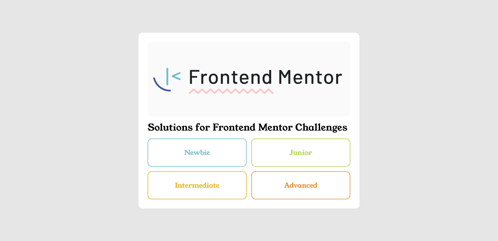

# Frontend Mentor Challenges Submissions

This document lists the challenges completed on Frontend Mentor, showcasing the progress and providing links to the challenge details and live demos. The table below includes the challenge number, difficulty level, a link to the challenge code, and a link to the live demo for each challenge.

## List

| #   | Level  | Code                                                                           | Demo                                                                                                         |
| --- | ------ | ------------------------------------------------------------------------------ | ------------------------------------------------------------------------------------------------------------ |
| 01  | Newbie | [QR code component](./src/newbie/qr-code-component/)                           | [Preview](https://ahmedsomaa.github.io/frontendmentor-challenges/src/newbie/qr-code-component/)              |
| 02  | Newbie | [Blog preview card](./src/newbie/blog-preview-card/)                           | [Preview](https://ahmedsomaa.github.io/frontendmentor-challenges/src/newbie/blog-preview-card/)              |
| 03  | Newbie | [Social links profile](./src/newbie/social-links-profile/)                     | [Preview](https://ahmedsomaa.github.io/frontendmentor-challenges/src/newbie/social-links-profile/)           |
| 04  | Newbie | [Recipe page](./src/newbie/recipe-page/)                                       | [Preview](https://ahmedsomaa.github.io/frontendmentor-challenges/src/newbie/recipe-page/)                    |
| 05  | Newbie | [Product preview card component](./src/newbie/product-preview-card-component/) | [Preview](https://ahmedsomaa.github.io/frontendmentor-challenges/src/newbie/product-preview-card-component/) |
