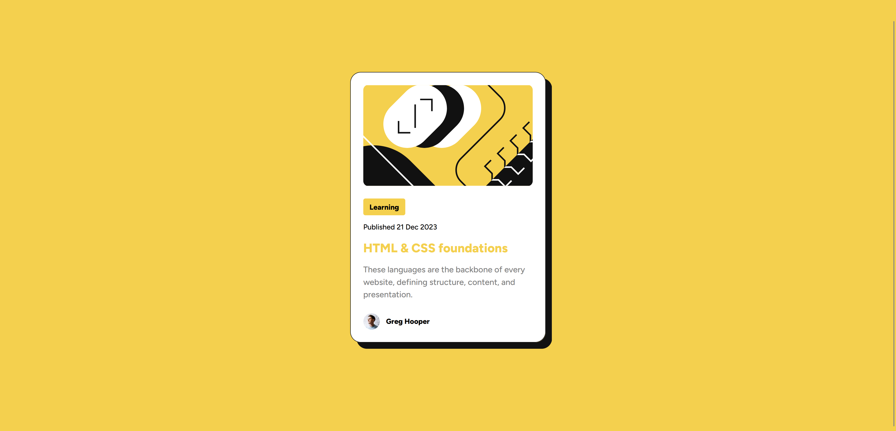

# Frontend Mentor - Blog preview card solution

This is a solution to the [Blog preview card challenge on Frontend Mentor](https://www.frontendmentor.io/challenges/blog-preview-card-ckPaj01IcS). Frontend Mentor challenges help you improve your coding skills by building realistic projects.

## Table of contents

- [Overview](#overview)
  - [Screenshot](#screenshot)
  - [Links](#links)
- [My process](#my-process)
  - [Built with](#built-with)
  - [What I learned](#what-i-learned)
  - [Continued development](#continued-development)
  - [Useful resources](#useful-resources)
- [Author](#author)
- [Acknowledgments](#acknowledgments)

## Overview

### Screenshot

#### Desktop


#### Mobile


#### Active States



### Links

- Solution URL: [Solution](https://github.com/ahmedsomaa/frontendmentor-challengs/tree/main/src/newbie/blog-preview-card)
- Live Site URL: [Demo](https://ahmedsomaa.github.io/frontendmentor-challengs/src/newbie/blog-preview-card/)

## My process

### Built with

- Semantic HTML5 markup
- CSS BEM Architecture
- Flexbox

### What I learned

I am proud of experimenting with the CSS `@property` rule, using `@media` queries for responsive design, and adopting a mobile-first approach.

#### CSS `@property` Rule

The `@property` rule allows you to define custom properties (CSS variables) with default values and specify their behavior, such as their initial value, syntax, and inheritance. This helps in managing dynamic styling in more complex designs.

```css
@property --main-color {
  syntax: "<color>";
  inherits: false;
  initial-value: #333;
}

.element {
  --main-color: #ff5733;
  color: var(--main-color);
}
```

#### Responsive Design with `@media` Queries:

Using @media queries helps adapt your layout and styling to different screen sizes, ensuring a better user experience across devices.

```css
/* Mobile-first approach */
body {
  font-size: 16px;
}

@media (min-width: 768px) {
  body {
    font-size: 18px;
  }
}

@media (min-width: 1024px) {
  body {
    font-size: 20px;
  }
}
```

#### Mobile-First Development:

A mobile-first approach means designing and coding for smaller screens first, then progressively enhancing the design for larger screens. This ensures that mobile users have a well-optimized experience from the start.

```css
/* Mobile-first styles */
.container {
  padding: 1rem;
}

/* Styles for tablets and larger devices */
@media (min-width: 768px) {
  .container {
    padding: 2rem;
  }
}

/* Styles for desktops */
@media (min-width: 1024px) {
  .container {
    padding: 3rem;
  }
}
```

### Useful resources

- [`@property`](https://developer.mozilla.org/en-US/docs/Web/CSS/@property) - This helped me understand how it works and its syntax.
- [`@media`](https://developer.mozilla.org/en-US/docs/Web/CSS/@media) - This helped me understand how it works and how to use it.

## Author

- Website - [Som3aware.vercel.app](https://som3aware.vercel.app)
- Frontend Mentor - [@ahmedsomaa](https://www.frontendmentor.io/profile/ahmedsomaa)
- Twitter - [@som3aware](https://www.x.com/som3aware)
