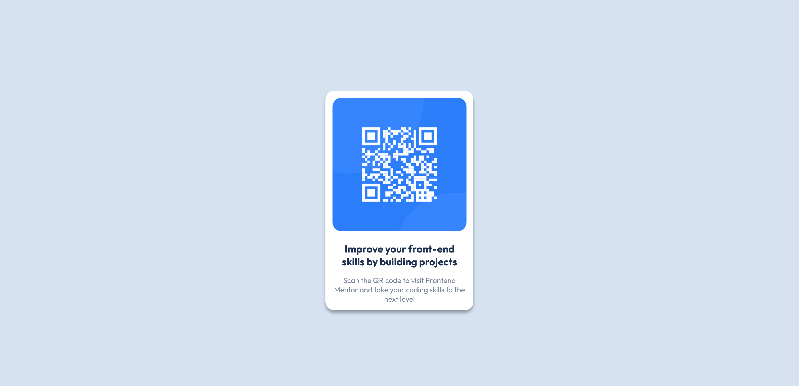
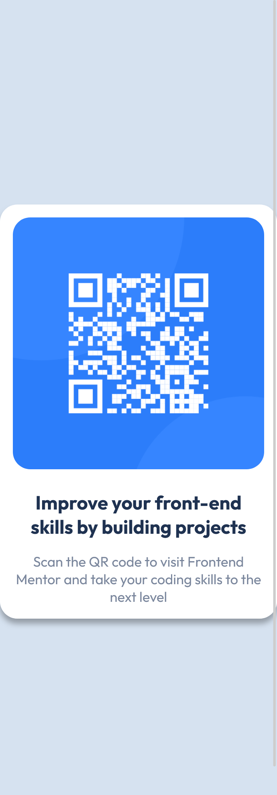

# Frontend Mentor - QR code component solution

This is a solution to the [QR code component challenge on Frontend Mentor](https://www.frontendmentor.io/challenges/qr-code-component-iux_sIO_H). Frontend Mentor challenges help you improve your coding skills by building realistic projects.

## Table of contents

- [Overview](#overview)
  - [Screenshot](#screenshot)
  - [Links](#links)
- [My process](#my-process)
  - [Built with](#built-with)
  - [What I learned](#what-i-learned)
  - [Continued development](#continued-development)
  - [Useful resources](#useful-resources)
- [Author](#author)
- [Acknowledgments](#acknowledgments)

## Overview

### Screenshot

#### Desktop



#### Mobile



### Links

- Solution URL: [Solution](https://github.com/ahmedsomaa/frontendmentor-challengs/tree/main/src/newbie/qr-code-component)
- Live Site URL: [Demo](https://ahmedsomaa.github.io/frontendmentor-challengs/src/newbie/qr-code-component/)

## My process

### Built with

- Semantic HTML5 markup
- CSS BEM Architecture
- Flexbox

### What I learned

#### HTML Landmarks

HTML landmarks are specific HTML elements that define the structure of a webpage. They help assistive technologies and browsers understand the layout and navigation of the page. Some common landmark roles include:

- **`<header>`**: Represents the header of a section or page, typically containing navigation or introductory content.
- **`<nav>`**: Defines a navigation section with links to other parts of the website.
- **`<main>`**: Encapsulates the main content of the page, excluding headers, footers, and navigation.
- **`<footer>`**: Indicates the footer of a section or page, usually containing contact information or copyright notices.
- **`<aside>`**: Represents content indirectly related to the main content, like sidebars or callouts.

```html
<header>
  <h1>Site Title</h1>
  <nav>
    <ul>
      <li><a href="#">Home</a></li>
      <li><a href="#">About</a></li>
      <li><a href="#">Contact</a></li>
    </ul>
  </nav>
</header>
<main>
  <h2>Main Content</h2>
  <p>This is where the main content of the page goes.</p>
</main>
<aside>
  <h3>Related Information</h3>
  <p>This is additional information related to the main content.</p>
</aside>
<footer>
  <p>© 2024 Your Website</p>
</footer>
```

#### BEM Architecture

BEM (Block, Element, Modifier) is a naming convention for classes in HTML and CSS that helps in creating reusable and maintainable code. It breaks down components into blocks, elements, and modifiers.

- Block: The top-level abstraction of a component (e.g., button).
- Element: A part of the block that performs a specific function (e.g., button\_\_icon).
- Modifier: A flag on a block or element that changes its appearance or behavior (e.g., button--large).

```html
<div class="button button--large">
  <span class="button__icon">🔍</span>
  <span class="button__text">Search</span>
</div>
```

```css
.button {
  padding: 10px 20px;
  border: none;
  background-color: #007bff;
  color: white;
  font-size: 16px;
  display: flex;
  align-items: center;
}

.button--large {
  font-size: 20px;
}

.button__icon {
  margin-right: 8px;
}

.button__text {
  font-weight: bold;
}
```

### Useful resources

- [BEM Architecture](https://getbem.com/) - This helped me grasp the gist of the BEM architecture. I really liked this pattern and will use it going forward.
- [Accessibility Landmarks](https://www.w3schools.com/accessibility/accessibility_landmarks.php) - This helped me understand that I have to design pages in a structured/semantic way so blind users can easily navigate the page when using a screen reader.

## Author

- Website - [Som3aware.vercel.app](https://som3aware.vercel.app)
- Frontend Mentor - [@ahmedsomaa](https://www.frontendmentor.io/profile/ahmedsomaa)
- Twitter - [@som3aware](https://www.x.com/som3aware)

## Acknowledgments

- [Øystein Håberg](https://www.frontendmentor.io/profile/Islandstone89) - His feedback on using `rem` for font sizes, incorporating a CSS reset, and adjusting element sizing and padding has greatly enhanced my understanding of creating responsive and accessible designs in CSS.
