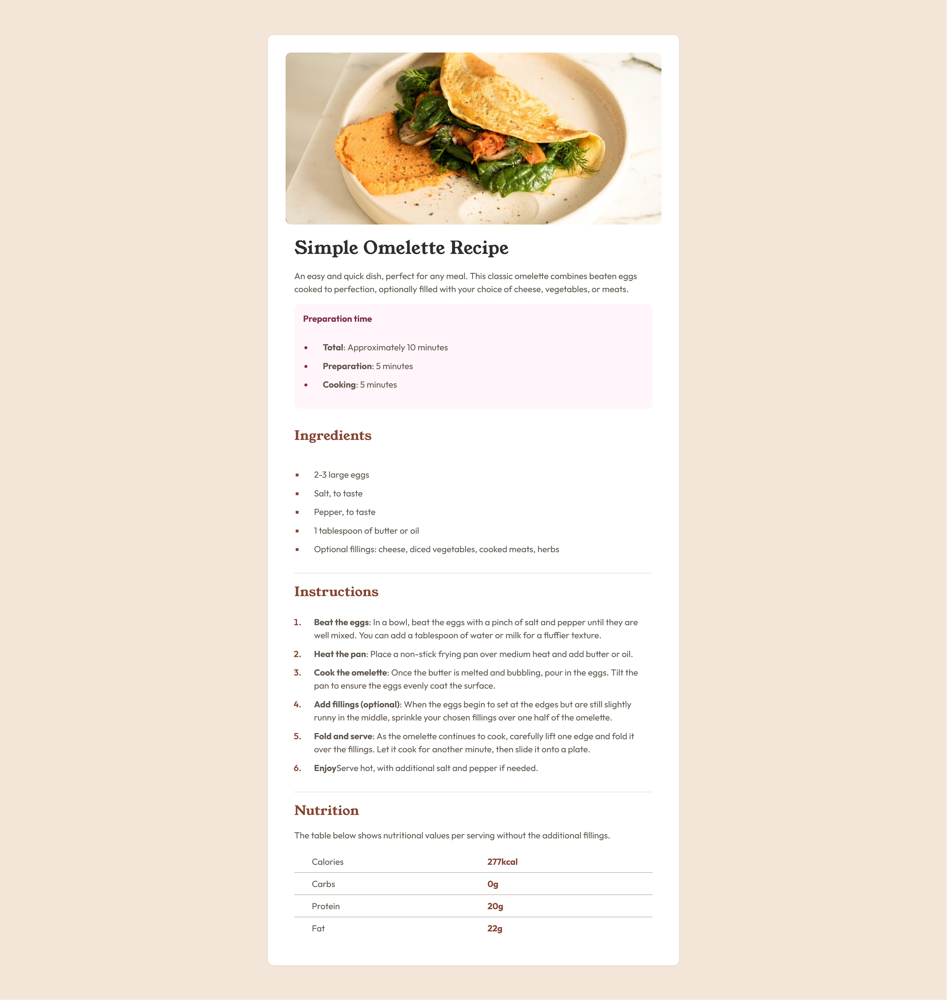
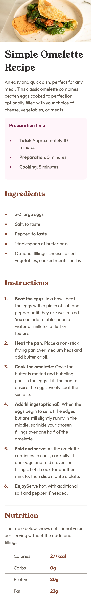

# Frontend Mentor - Recipe page solution

This is a solution to the [Recipe page challenge on Frontend Mentor](https://www.frontendmentor.io/challenges/recipe-page-KiTsR8QQKm). Frontend Mentor challenges help you improve your coding skills by building realistic projects.

## Table of contents

- [Overview](#overview)
  - [Screenshot](#screenshot)
  - [Links](#links)
- [My process](#my-process)
  - [Built with](#built-with)
  - [What I learned](#what-i-learned)
  - [Continued development](#continued-development)
  - [Useful resources](#useful-resources)
- [Author](#author)
- [Acknowledgments](#acknowledgments)

## Overview

### Screenshot

#### Desktop



#### Mobile



### Links

- Solution URL: [Solution](https://github.com/ahmedsomaa/frontendmentor-challengs/tree/main/src/newbie/recipe-page)
- Live Site URL: [Demo](https://ahmedsomaa.github.io/frontendmentor-challengs/src/newbie/recipe-page/)

## My process

### Built with

- Semantic HTML5 markup
- Mobile-First design
- Flexbox
- Grid

### What I learned

#### Adding Border to Table Rows:

I encountered a challenge with adding a border to table rows (<tr>). It worked when applied to <td> elements but not to <tr>. After some research, I learned about the `border-collapse` property, which allows borders to be applied to table rows effectively.

```cs
table {
  border-collapse: collapse;
}

td, th {
  border: 1px solid #ddd;
}
```

### Useful resources

- [CSS border-collapse Property](https://www.w3schools.com/cssref/pr_border-collapse.php) - This helped me understand how it works and its syntax.

## Author

- Website - [Som3aware.vercel.app](https://som3aware.vercel.app)
- Frontend Mentor - [@ahmedsomaa](https://www.frontendmentor.io/profile/ahmedsomaa)
- Twitter - [@som3aware](https://www.x.com/som3aware)
