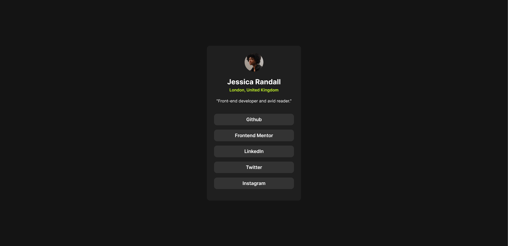
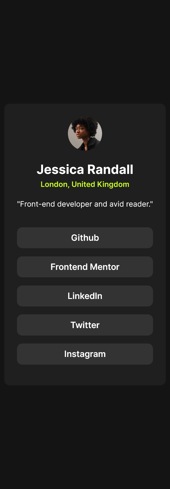
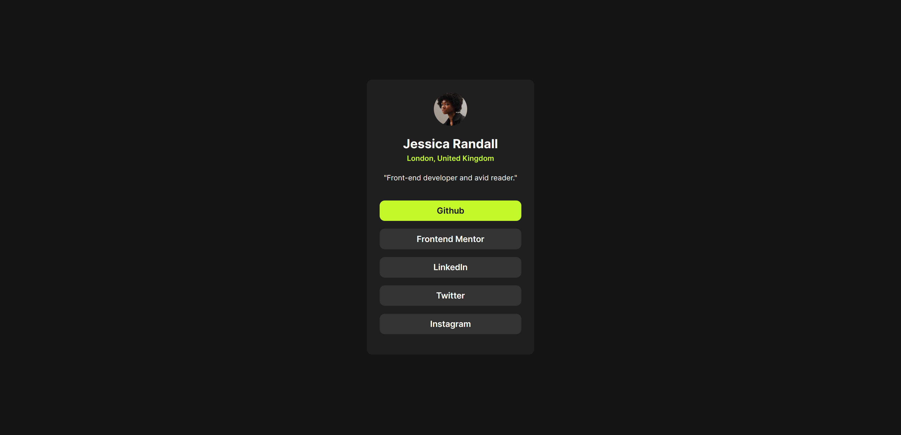

# Frontend Mentor - Social links profile solution

This is a solution to the [Social links profile challenge on Frontend Mentor](https://www.frontendmentor.io/challenges/social-links-profile-UG32l9m6dQ). Frontend Mentor challenges help you improve your coding skills by building realistic projects.

## Table of contents

- [Overview](#overview)
  - [Screenshot](#screenshot)
  - [Links](#links)
- [My process](#my-process)
  - [Built with](#built-with)
  - [What I learned](#what-i-learned)
  - [Continued development](#continued-development)
  - [Useful resources](#useful-resources)
- [Author](#author)
- [Acknowledgments](#acknowledgments)

## Overview

### Screenshot

#### Desktop

#### Mobile

#### Active States

### Links

- Solution URL: [Solution](https://github.com/ahmedsomaa/frontendmentor-challengs/tree/main/src/newbie/social-links-profile)
- Live Site URL: [Demo](https://ahmedsomaa.github.io/frontendmentor-challengs/src/newbie/social-links-profile/)

## My process

### Built with

- Semantic HTML5 markup
- CSS custom properties
- Flexbox

## Author

- Website - [Som3aware.vercel.app](https://som3aware.vercel.app)
- Frontend Mentor - [@ahmedsomaa](https://www.frontendmentor.io/profile/ahmedsomaa)
- Twitter - [@som3aware](https://www.x.com/som3aware)
